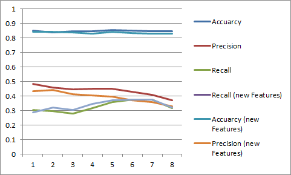

# Results

1. Summarize for us the goal of this project and how machine learning is useful 
in trying to accomplish it. As part of your answer, give some background on the 
dataset and how it can be used to answer the project question. Were there any 
outliers in the data when you got it, and how did you handle those?  [relevant 
rubric items: data exploration, outlier investigation]

In this project, an algorithm was built to identify fraudlous Enron Employees.

- 146 people in the dataset
- Only 1 feature (out of 21), "POI,"  did not contain missing values. 
- 21 Features available like 'salary', 'deferral_payments', 'total_payments', etc.
- 18/146 are People of Interest, 35 for our definition.

The dataset contain numerous missing data (NaN values).

| Feature                    | Missing Values |
| -------------------------- |:--------------:|
| salary                     | 51             |
| to_messages                | 60             |
| deferral_payments          | 107            |
| total_payments             | 21             |
| loan_advances              | 142            |
| bonus                      | 64             |
| email_address              | 35             |
| restricted_stock_deferred  | 128            |
| total_stock_value          | 20             |
| shared_receipt_with_poi    | 60             |
| long_term_incentive        | 80             |
| exercised_stock_options    | 44             |
| from_messages              | 60             |
| other                      | 53             |
| from_poi_to_this_person    | 60             |
| from_this_person_to_poi    | 60             |
| poi                        | 0              |
| deferred_income            | 97             |
| expenses                   | 51             |
| restricted_stock           | 36             |
| director_fees              | 129            |

Through data visualization and the csv file I got from the dataset, we can 
easily appreciate the outlier, 'TOTAL', 'THE TRAVEL AGENCY IN THE PARK' and 
'LOCKHART EUGENE E'.

LOCKHART EUGENE E: Contains only NaN values.
TOTAL: It's an extreme outlier, you can see it in the scatter plot.
THE TRAVEL AGENCY IN THE PARK: It's not a name.

I have removed these records.

---

2. What features did you end up using in your POI identifier, and what 
selection process did you use to pick them? Did you have to do any scaling? Why 
or why not? As part of the assignment, you should attempt to engineer your own 
feature that does not come ready-made in the dataset -- explain what feature 
you tried to make, and the rationale behind it. (You do not necessarily have to 
use it in the final analysis, only engineer and test it.) In your feature 
selection step, if you used an algorithm like a decision tree, please also give 
the feature importances of the features that you use, and if you used an 
automated feature selection function like SelectKBest, please report the 
feature scores and reasons for your choice of parameter values.  [relevant 
rubric items: create new features, intelligently select features, properly
scale features]

'fraction_to_poi' and 'fraction_from_poi' were my two created features. The 
first is the frequency an employee sent emails to POIs and the latter is the 
frequency an employee received emails from POIs. The more you've been in contact 
with a POI, the more likely it would seem he/she may have been involved with the
fraud.

Using SelectKBest to get the best features, I compared the results (accuarcy, 
precision and recall) of all of them and eventually chose 7. You can see below 
the table and chart of the results. 

Normal Features:

| k   | Accuarcy | Precision  | Recall  |
| --- |:--------:|:----------:|:-------:|
| 2   | 0.85210  | 0.48304    | 0.30477 |
| 3   | 0.83949  | 0.45824    | 0.29800 |
| 4   | 0.84769  | 0.44512    | 0.27886 |
| 5   | 0.84675  | 0.45052    | 0.31850 |
| 6   | 0.85738  | 0.44924    | 0.35879 |
| 7   | 0.85261  | 0.43183    | 0.37583 |
| 8   | 0.84667  | 0.40897    | 0.37417 |
| 9   | 0.84535  | 0.37247    | 0.31758 |

With new Features:

| k   | Accuarcy | Precision  | Recall  |
| --- |:--------:|:----------:|:-------:|
| 2   | 0.84205  | 0.43570    | 0.28990 |
| 3   | 0.84128  | 0.44283    | 0.32108 |
| 4   | 0.83925  | 0.41376    | 0.30562 |
| 5   | 0.83225  | 0.40340    | 0.34635 |
| 6   | 0.84119  | 0.39630    | 0.37286 |
| 7   | 0.83571  | 0.37302    | 0.37644 |
| 8   | 0.83143  | 0.36088    | 0.37719 |
| 9   | 0.83023  | 0.32825    | 0.32117 |

- With 5 features, you can see a precision drop, while recall peak is between
6-7.
- Accuracy is approximately the same from 2 - 8 features. 
- Combining the two above points, that's why 7 features were chosen. 
 
An alternative approach would be to select the features based on the scores 
provided. Based on the scores they fell significantly after the salary 
feature (4th highest).

Below we can see a table with the features with highest variance. 

| Feature                    | Score               |
| -------------------------- |:-------------------:|
| exercised_stock_options    | 24.815079733218194  |
| total_stock_value          | 24.182898678566879  |
| bonus                      | 20.792252047181535  |
| salary                     | 18.289684043404513  |
| deferred_income            | 11.458476579280369  |
| long_term_incentive        | 9.9221860131898225  |
| restricted_stock           | 9.2128106219771002  |
| total_payments             | 8.7727777300916756  |
| shared_receipt_with_poi    | 8.589420731682381   |
| loan_advances              | 7.1840556582887247  |
| expenses                   | 6.0941733106389453  |
| from_poi_to_this_person    | 5.2434497133749582  |
| other                      | 4.1874775069953749  |
| from_this_person_to_poi    | 2.3826121082276739  |
| director_fees              | 2.1263278020077054  |
| to_messages                | 1.6463411294420076  |
| deferral_payments          | 0.22461127473600989 |
| from_messages              | 0.16970094762175533 |
| restricted_stock_deferred  | 0.06549965290994214 |

I will use 'exercised_stock_options', 'total_stock_value', 'bonus', 'salary', 
'deferred_income', 'long_term_incentive' and 'restricted_stock'.

After feature engineering and using SelectKBest, I scaled features using 
MinMaxScaler(). If we do not normalize the features, some machine learning 
algorithms might not work properly.

---

3. What algorithm did you end up using? What other one(s) did you try? How did 
model performance differ between algorithms?  [relevant rubric item: pick an 
algorithm]

I tested 4 algorithms: SVM, Regression, KMeans and Naive Bayes. Below we can see 
the results with the best parameters for each case.

| Feature        | Accuarcy        | Precision      | Recall          |
| -------------- |:---------------:|:--------------:|:---------------:|
| Naive Bayes    | 0.854761904762  | 0.432977633478 | 0.373191558442  |
| K-means        | 0.337619047619  | 0.664069275329 | 0.324404761905  |
| Regression     | 0.859761904762  | 0.400333333333 | 0.190000721501  |
| SVM            | 0.866428571429  | 0.141666666667 | 0.0384523809524 |

SVM parameters:
    kernel = 'linear'
    C = 1
    gamma = 1
    
Regression parameters: 
    tol = 1
    C = 0.1

KMeans parameters:
    tol = 0.1
    n_clusters = 5

As final decision, we choose Naive Bayes algorythm, as it has the highest 
precision and recall. We can see below the accuarcy, precision and recall for
for each algorithm with the new features included. 

| Feature        | Accuarcy        | Precision      | Recall          |
| -------------- |:---------------:|:--------------:|:---------------:|
| Naive Bayes    | 0.842619047619  | 0.395617965368 | 0.37384992785   |
| K-means        | 0.369047619048  | 0.760431767809 | 0.37380952381   |
| Regression     | 0.859285714286  | 0.466736263736 | 0.244305916306  |
| SVM            | 0.86619047619   | 0.093833333333 | 0.0442738095238 |

SVM parameters:
    kernel = 'rbf'
    C = 0.1
    gamma = 1
    
Regression parameters: 
    tol = 1
    C = 0.1

KMeans parameters:
    tol = 1
    n_clusters = 5

As we expected, when we include the new features most of parameters (Accuarcy,
Precission and Recall) get worse.
   
                                                                
---

4. What does it mean to tune the parameters of an algorithm, and what can 
happen if you don't do this well?  How did you tune the parameters of your 
particular algorithm? What parameters did you tune? (Some algorithms do not 
have parameters that you need to tune -- if this is the case for the one you 
picked, identify and briefly explain how you would have done it for the model 
that was not your final choice or a different model that does utilize parameter 
tuning, e.g. a decision tree classifier).  [relevant rubric items: discuss 
parameter tuning, tune the algorithm]

Tuning the algorithm parameters refers to finding the parameters which has the
highest Accuracy, Precision and Recall. This can be effective but also can 
lead to overfit. Overfit can get a bad results during the learning process.

Naive Bayes, which is the chosen algorithm does not need
parameters.

I used GridSearchCV to get the best parameter for each algorithm.

SVM parameters:
    kernel = 'linear'
    C = 1
    gamma = 1
    
Regression parameters: 
    tol = 1
    C = 0.1

KMeans parameters:
    tol = 0.1
    n_clusters = 5

---

5. What is validation, and whats a classic mistake you can make if you do it 
wrong? How did you validate your analysis?  [relevant rubric items: discuss 
validation, validation strategy]

Model validation is the process where a trained model is 
evaluated with a testing data set.

Model validation is carried out after model training. Together with model 
training, model validation aims to find an optimal model with the best 
performance.

A classic mistake is overfitting, it happend when the model performed well in
training but not in the test set. In order to avoid this overfitting, I have
created a function called evaluateClf which I calculate the mean of accuarcy, 
precision and recall of 100 different training data.

---

6. Give at least 2 evaluation metrics and your average performance for each of 
them.  Explain an interpretation of your metrics that says something 
human-understandable about your algorithms performance. [relevant rubric item: 
usage of evaluation metrics]

With the help of train_test_split I get the set of training data in a random
way. I use a test_size=0.3. We get a result similar to our model.

Results without new Features:

| Feature        | Accuarcy        | Precision      | Recall          |
| -------------- |:---------------:|:--------------:|:---------------:|
| Naive Bayes    | 0.854761904762  | 0.432977633478 | 0.373191558442  |

Results with new Features:

| Feature        | Accuarcy        | Precision      | Recall          |
| -------------- |:---------------:|:--------------:|:---------------:|
| Naive Bayes    | 0.835714285714  | 0.373023809524 | 0.376445165945  |

I have considered precision and recall the most importants parameters. 
Precision indicates the ratio of true positives to the records POIs. It means
that every 100 people there are 43 POIs and only 37 are correctly classified
as POIs. We want to make sure that people are not "falsely accused." The higher the
precision, the lower our percentage of false accusations compared to accurate 
accusations. Recall is the ratio of true positives to the records POIs. In the case
of my model approximately 37.31% of the people who are POIs were correctly identified 
by the model. This is important because we want to catch as many of the POIs as possible, 
so they get what they deserve. 